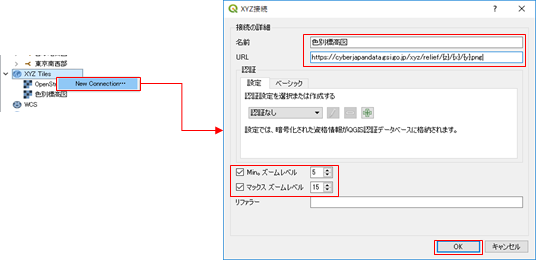

# QGISで地理院タイルを表示する

QGISのレイヤで地理院タイルを表示するには、以下の手順で行います。

１． **「ブラウザ」**パネルで **[XYZ Tiles]** を右クリックして **[New Connection]** をクリックします。  
２．**「XYZ接続」**ダイアログで地図タイルのサイトURLを設定して **[OK]** をクリックします（ 下図参照：名称は自由に設定できます）。
  
  

ここで設定する「URL」は、地理院タイルの場合は、[https://maps.gsi.go.jp/development/ichiran.html](https://maps.gsi.go.jp/development/ichiran.html) に載っていますので、目的の地図のURLを指定して使用ください。

※（地理院タイルを利用するときは、必ず、上記ページに記載されている規約に従って利用ください。）

３．作成されたタイルレイヤをダブルクリック（または右クリックして \[選択したレイヤをキャンバスに追加\] を選択）すればレイヤーパネルにタイルが読み込まれます。

※ Open Street Mapなど、他のXYZ形式のタイルも上記の方法で追加することもできます。（Open Streep Map の場合は、URLで「[http://a.tile.openstreetmap.org/{z}/{x}/{y}.png」](http://a.tile.openstreetmap.org/{z}/{x}/{y}.png」) と指定します）

