# QGISのジオリファレンサーを使用する  

## GeoTIFF形式の画像データを作る  

### GeoTIFFとは  

GeoTIFFとは、TIFF形式の画像ファイルに地理空間（ジオリファレンス）情報のタグが埋め込まれた画像データです。GeoTIFFファイルは、ラスターデータとしてQGISなどのGIS上に表示することができます。  

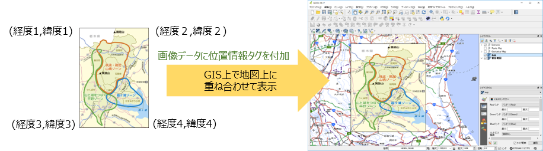  

### QGISのGDALジオリファレンサー プラグインを使用する  

QGISでGeoTIFFファイルを作成するには、 「**GDALジオリファレンサー**」プラグインを使用します。  
下図のように、 **[プラグイン]-[プラグインの管理とインストール…]** をクリックして、プラグイン管理ダイアログの「インストール済」タブに「GDALジオリファレンサー」が表示されれば、GDALジオリファレンサーはインストールされています。  

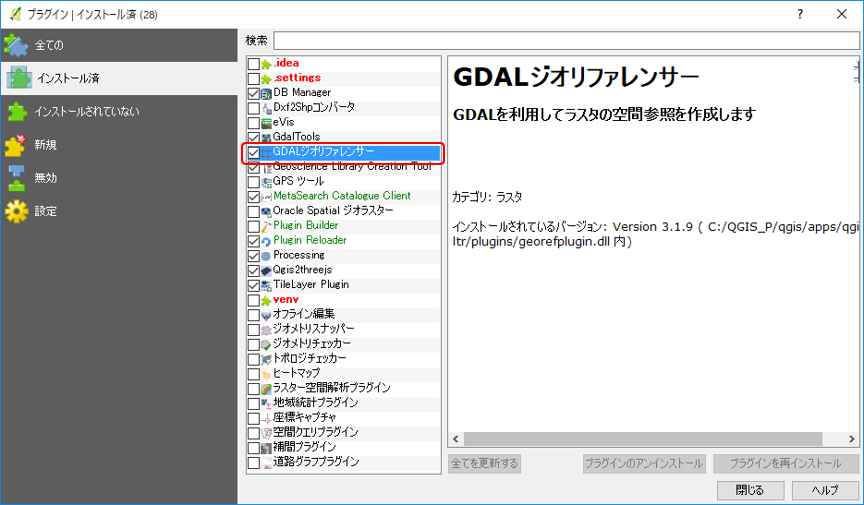  

GDALジオリファレンサープラグインは、QGISのインストール時に一緒にインストールされます。もし、GDALジオリファレンサープラグインがインストールされていないようであれば、QGISを再インストールする必要があります。  

### GeoTIFFの作成方法  

#### 【既存の画像データからGeoTIFFを作成する】  

QGISで既存の画像データからGeoTIFFを作成するには、GDALジオリファレンサーを使用して、以下の手順で行います。

① **[ラスタ]-[ジオリファレンサ]-[ジオリファレンサ]** をクリックします。  

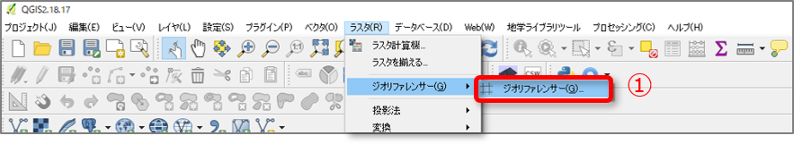  

⓶ ジオリファレンサーの画面が表示されたら、**[ファイル]-[ラスタを開く…]** をクリックします。  

③ ファイル選択ダイアログが表示されたら、変換元の画像ファイルを選択して、**[開く]** をクリックします。  

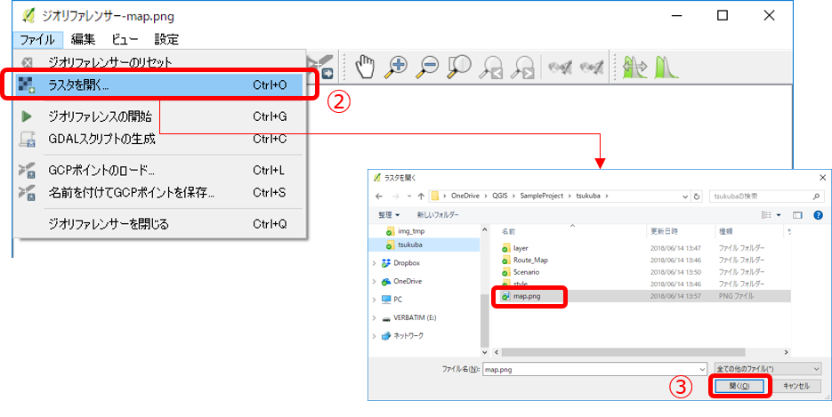  

④ 「空間参照システム選択」の画面が表示されたら、プロジェクトで使用しているものと同じCRSを選択して、**[OK]** をクリックします。  

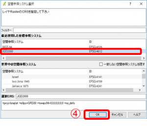  

⑤ ジオリファレンサー画面に、③で選択した画像が表示されます。「ポイントの追加」アイコン（または **[編集]-[ポイントの追加]** ）をクリックして、ポイントの追加モードの状態にします。  

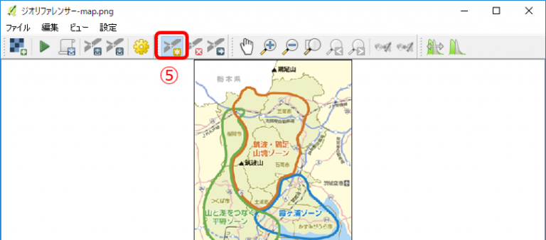  

⑥ マウスホイールや、カーソルキーを使用して画像を拡大し、座標参照を行いたい箇所に十字のマウスカーソルをあててクリックし、ポイントを追加します。  

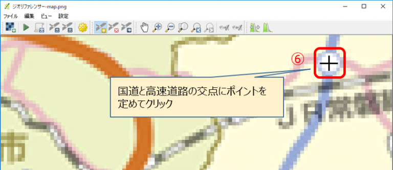  

⑦ 「地図座標を入力」ダイアログが表示されたら、**[マップキャンバスより]** をクリックします。  

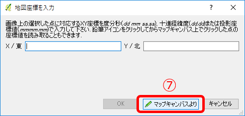  

⑧ QGISのマップキャンバスを表示し、⑦で指定したポイントに対応するQGISマップキャンバス上の座標をクリックします。  

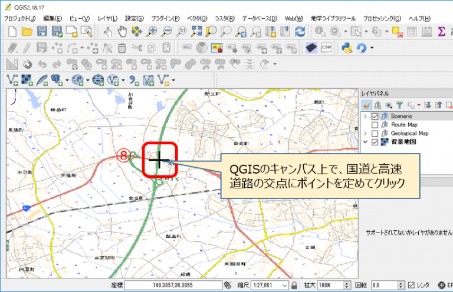  

⑨ 「地図座標を入力」ダイアログ が表示され、座標が入力されていることを確認したら、**[OK]** をクリックします。  

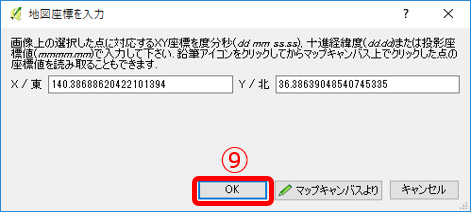  

⑩ ジオレファレンサー画面で、指定した箇所にポイント（赤点）が追加されていることを確認します。  

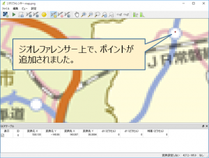  

⑪ 上記⑥～⑩の作業を繰り返して行い、複数ポイント（３か所以上）を追加します。

⑫ ジオリファレンスポイントの追加が完了したら、ジオリファレンスを行います。「ジオリファレンスの開始」アイコン（または **[ファイル]-[ジオリファレンスの開始]** ）をクリックします。  

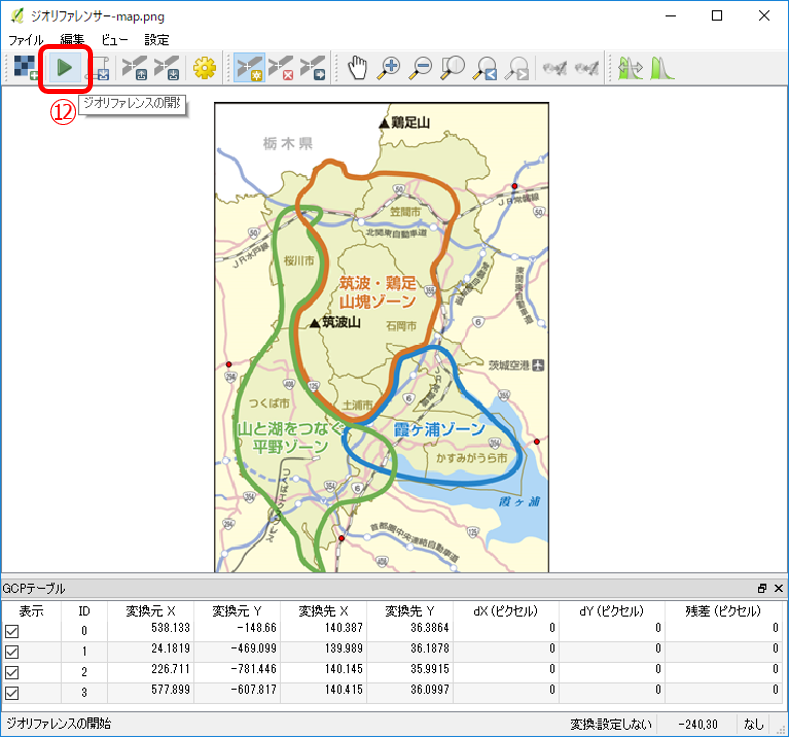  

この図の例では、４か所ポイントを設定しています。リファレンスポイントは、なるべく離れた地点（画像の隅に近い点）を設定することで、制度のよいジオリファレンスが行えます。  

⑬ 「変換タイプを設定してください」のメッセージが表示されたら、**[OK]** をクリックします。  

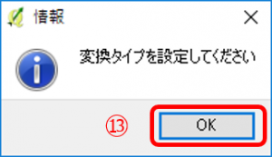  

⑭ 「変換の設定」ダイアログが表示されたら、各種項目の設定を行い **[OK]** をクリックします。以下の設定は必ず行ってください。  
・ 出力ラスタ：生成するGeoTiffファイルの保存場所と名前を指定します。  
・「完了時にQGISにロードする」：チェックします。  

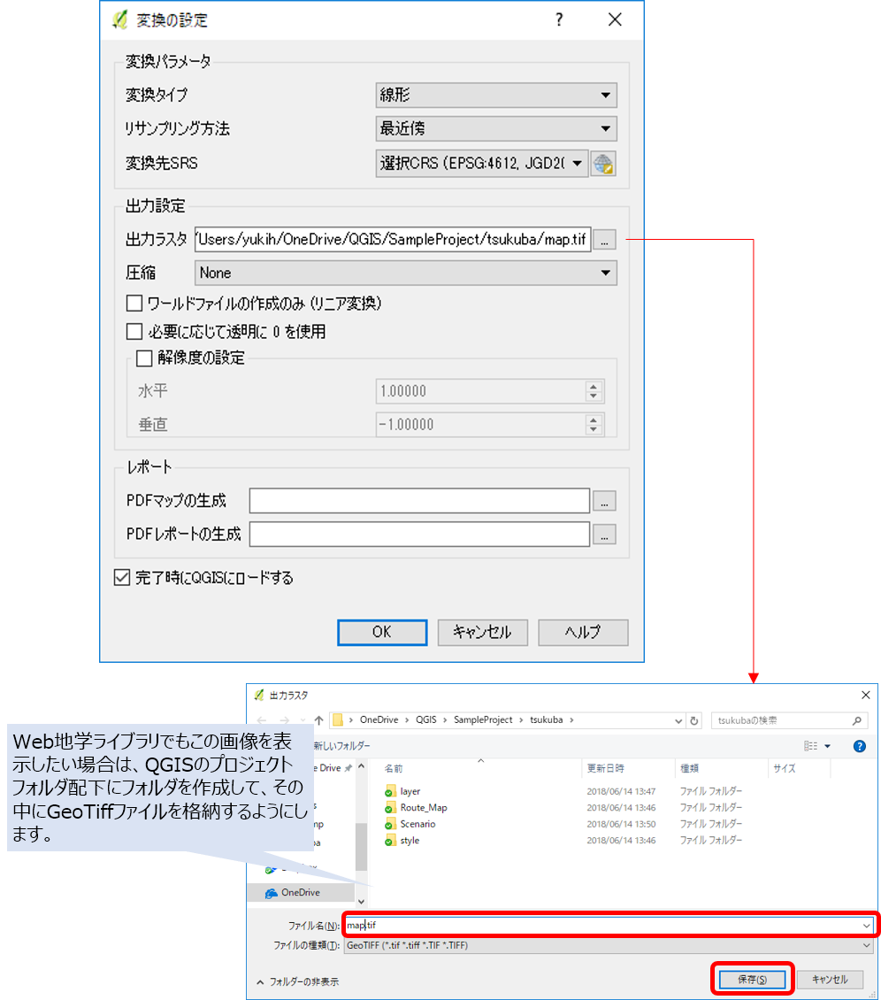  

⑮ 「変換の設定」が終了したら、ジオリファレンサー画面で 「ジオリファレンスの開始」アイコン（または **[ファイル]-[ジオリファレンスの開始]** ）をクリックするとジオリファレンスが開始され、GeoTiffファイルが生成されます。  

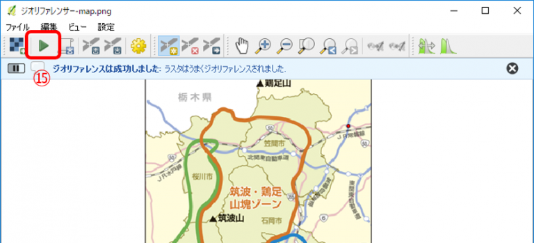  

⑯ QGISでは、ラスタレイヤとしてジオリファレンスされたGeoTiff画像が表示されます。  

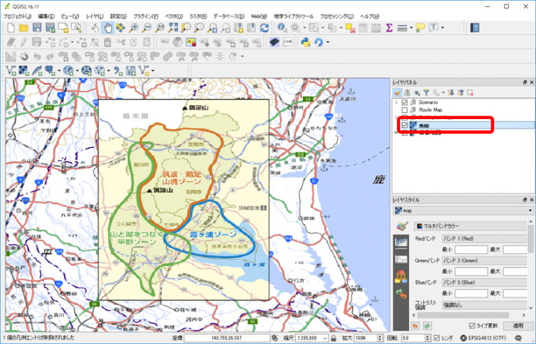  

