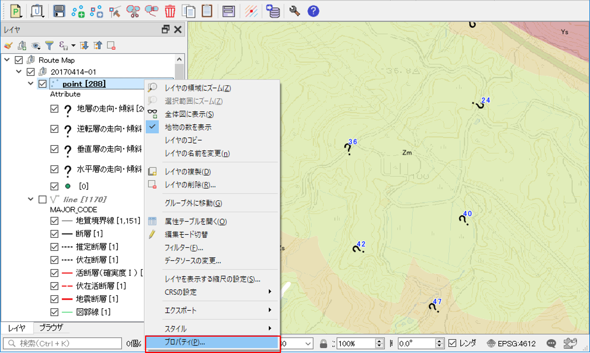
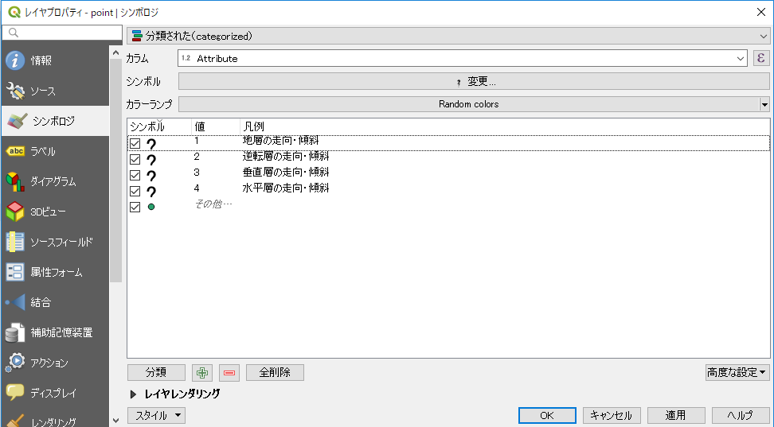
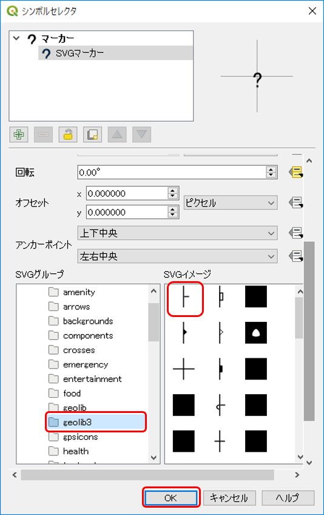
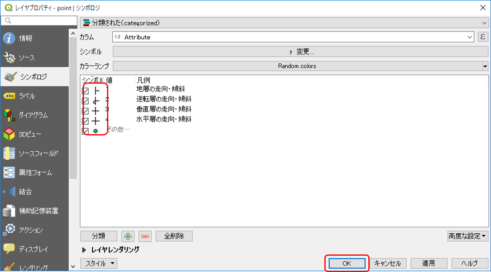
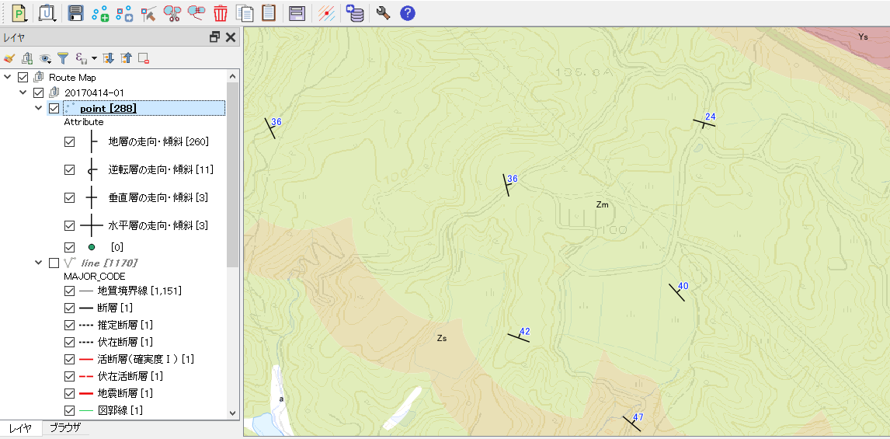

# シンボルが表示されない場合

ポイント（点）の地物にSVGマーカーを使用していると、下図のように？マークに変わってしまって、正常に表示されないことがあります。

  

これは、このレイヤーのスタイル定義で指定しているSVGファイルのパスが間違っているためですので、スタイル定義を以下のように修正してください。  

① レイヤーパネルでスタイル定義を変更したいレイヤーを右クリックして、プルダウンメニューの **[プロパティ]** をクリックします。  

② レイヤプロパティで「シンボロジ」タブをクリックして、変更したいシンボル部分をダブルクリックします。  

  

③ シンボルセレクタ画面が表示されたら、 **「SVGマーカー」** を選択して、表示させたい **「SVGイメージ」** を選択して **[OK]** をクリックします。  
「地学ライブラリツール」プラグインがインストールされていれば、走向・傾斜記号などの地質図で必要なSVGファイルは「geolib3」グループ に格納されています。  

  

④ 上記③の作業を、すべての？マークになっているシンボルに対して行います。下の図のようになればOKです。  

  

② レイヤプロパティで **[OK]** をクリックして閉じると、マップキャンバス上のシンボルが正しく表示されます。  

  