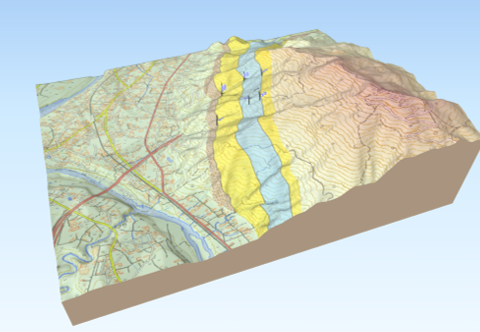
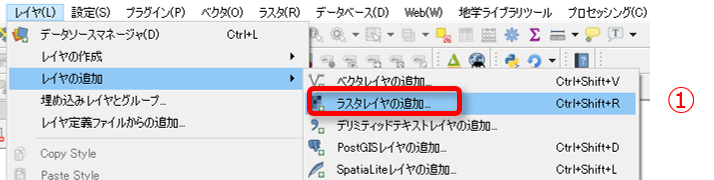
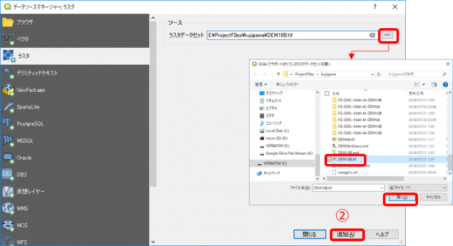
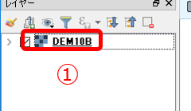
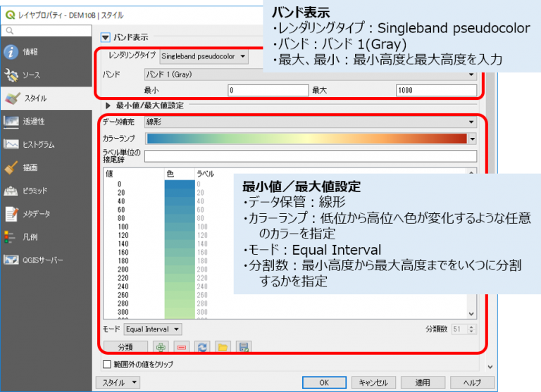

# QGISで立体図を作成する

QGIS バージョン３では、3次元の座標をもつベクターデータが取り扱うことができるようになり、3Dの表現の可能性が広がりました。

しかし、３次元ポリゴンで地層を表現するのは、そのデータを作成するには大変な労力が必要ですので、現実的には、地形図上に投影した２次元の地質分布に地表の標高データを組み合わせて３D地質図を作成するという方法をとります。  

QGISでは、標準で「３Dビュー」機能を持っておりリアルタイムで編集した地物を３Dで表示することができますが、PCの処理性能が低いと動作が遅く使い勝手が悪くなってしまいます。そこで「Qgis2threejs」プラグインを用いて行う方法を推奨します。このプラグインを使用すれば、下図のような３D図を作成することができます。

  

このような立体図を作成するには「標高DEMデータ」をラスタレイヤとしてQGISに読み込んでおくことが必要となりますが、Qgis2three.jsでは、このDEMデータに「国土地理院標高タイル」を使用することができます。
インターネットを使用できる環境であれば、下記の手順の作業は必要ありません。  

ここでは、標高タイルが使用できない場合の標高DEMの読み込みの手順を解説をします。

## 1. 標高DEMデータを入手する

日本の標高データは、国土地理院の「[基盤地図情報 ダウンロードサービス](https://fgd.gsi.go.jp/download/menu.php)」から、対象地域の「数値標高モデル」DEMデータをダウンロードして入手することができます。ただし、ダウンロードにはユーザー登録（無料）が必要ですので、規約を守って利用してください。

## 2.標高DEMデータを「GeoTIFF」に変換・結合する

1.でダウンロードした標高DEMデータはそのままQGISに読み込むことはできませんので、データを「**GeoTIFF**」形式に変換・結合する必要があります。

以前のQGIS2.xでは、この変換ツールがプラグインとして提供されていたのですが、3.xバージョンではまだ変換プラグインが提供されていません。 変換ツールはいくつかの会社や個人が提供しているものがありますので、インターネットで「標高DEM 変換」などのキーワードで検索して、使えそうなツールを探してみてください。  

## 3. ラスタレイヤに標高DEMを追加する

GeoTIFF形式に変換した標高データをQGISに読み込むには、以下のように行います。  

① **[レイヤ]-[レイヤの追加]-[ラスタレイヤの追加…]** をクリックします。  

⓶ ラスターデータセットに、読み込む標高DEMのtiffファイルを指定して **[追加]** をクリックします。  

  

③ レイヤが追加されます。  

  

## 4. スタイルを設定する

標高DEMのラスターデータを高度ごとに色付けしたいなど、スタイルを変更したい場合は以下のように設定します。  

① レイヤーパネルでレイヤをダブルクリックして、プロパティを開きます。  

  

⓶ レイヤープロパティで「スタイル」タブを開き、以下の図のように設定します。  

  

これで、DEMデータを使用してマップキャンバス上に色別標高図を表示することができます。  
Qgis2three.jsプラグインで３D図を作成する場合は、このレイヤーを指定してください。  